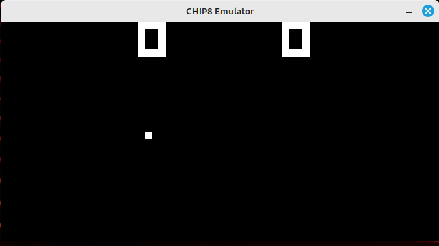

## CHIP 8 emulator/interpreter

To run the game, simply change a path in chip8.go to your game and run `go run chip8.go`

You will need to install sdl c libraries.

The game uses scancodes to match the correct keys. So, it'll work on different layouts.
Example key mapping for a qwerty keyboard:
<pre>
Keypad                   Keyboard
+-+-+-+-+                +-+-+-+-+
|1|2|3|C|                |1|2|3|4|
+-+-+-+-+                +-+-+-+-+
|4|5|6|D|                |Q|W|E|R|
+-+-+-+-+       =>       +-+-+-+-+
|7|8|9|E|                |A|S|D|F|
+-+-+-+-+                +-+-+-+-+
|A|0|B|F|                |Z|X|C|V|
+-+-+-+-+                +-+-+-+-+
</pre>
